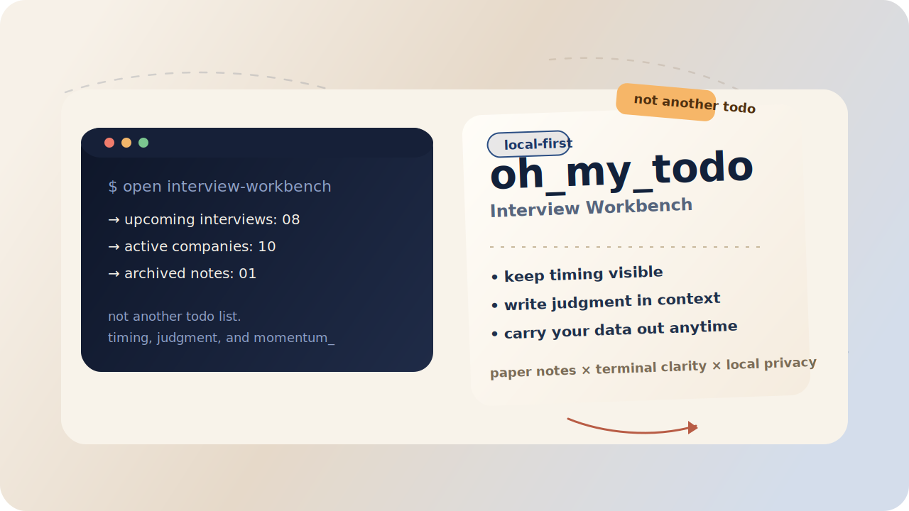
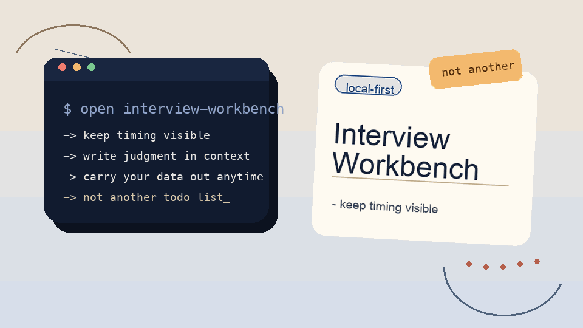

<p align="center">
  
</p>

<h1 align="center">oh_my_todo</h1>

<p align="center">
  <strong>一个给真正需要判断的人用的面试工作台，而不是另一个打勾清单。</strong>
</p>

<p align="center">
  <a href="./README.md">English</a>
</p>

<p align="center">
  
  
  
  
  
</p>

<p align="center">
  一个把面试日程、公司判断和轮次备注放在同一张桌面上的本地优先工作台。
</p>

<p align="center">
  
</p>

```text
┌──────────────────────────────────────────────────────────────┐
│  oh_my_todo :: interview workbench                          │
│                                                              │
│  next 7 days      keep scheduled interviews visible          │
│  company board    group active processes in one place        │
│  judgment notes   write what you think, not just what is due │
│  portable data    export JSON and carry everything with you  │
│  privacy mode     local-first, no login, browser-only        │
└──────────────────────────────────────────────────────────────┘
```

## 为什么会有这个项目

普通 todo 应用很适合收集任务，但面试并不只是任务。

当你在判断一家公司值不值得继续推进时，通常需要同时看到三类信息：

- 已经排好的面试时间
- 每个流程的轮次进度如何，从而推导出当前的筛选 / 面试视角
- 每一轮之后你对这家公司的真实判断

`oh_my_todo` 就是围绕这个现实来设计的。它不是为了把琐事一个个打勾，而是为了把时间、推进状态和主观判断留在同一个工作台里。

## 它和其他 todo 有什么不同

| 普通 todo 应用 | `oh_my_todo` |
| --- | --- |
| 核心单位是任务 | 核心单位是公司 + 面试流程 |
| 更强调完成率 | 更强调判断质量 |
| 备注往往散落在别处 | 公司判断和轮次备注直接挨着面试安排 |
| 往往默认你要注册账号 | 不需要登录就能使用 |
| 数据经常被困在应用内部 | JSON 导出 / 导入是默认能力 |
| 时间通常只是截止日期 | 时间在这里是真实的面试时间线 |

## 项目亮点

- **面试优先的界面结构**：未来 7 天时间线和分组后的公司看板在同一个页面里。
- **判断和上下文放在一起**：公司整体印象和具体轮次备注放在同一张卡片里。
- **本地优先的隐私模型**：没有账号、没有后端依赖、没有强制同步。
- **天然可迁移**：支持结构化 JSON 导出，想本地编辑也可以，再导回项目继续用。
- **更适合真实推进**：它更擅长回答“这家公司我要不要继续推”，而不是“第 14 个任务打勾了吗”。

## 你可以用它做什么

- 不登录直接创建公司和首个面试流程。
- 在一个地方维护面试轮次、备注和日程；筛选 / 面试视角由轮次进度推导出来。
- 维护公司的整体印象，并让每一轮备注持续补充你的判断。
- 按公司类型或推导出的筛选 / 面试视角切换看板分组。
- 手动归档已经结束的流程；当一家公司的流程全部归档后，它会出现在归档区。
- 导出完整工作台 JSON。
- 重新导入之前导出的 JSON，恢复或迁移你的数据。

## 快速开始

### 环境要求

- Node.js `^20.19.0 || >=22.12.0`
- npm

### 安装并运行

```bash
git clone https://github.com/SevenTianyu/oh_my_todo.git
cd oh_my_todo
npm install
npm run dev
```

然后打开 [http://localhost:5173](http://localhost:5173)。

### Shell 一句话安装运行

```bash
git clone https://github.com/SevenTianyu/oh_my_todo.git && cd oh_my_todo && npm install && npm run dev
```

## 用 Claude Code 和 Codex 一句话启动

如果你更希望让 agent 帮你完成安装和运行，那么进入仓库之后，下面这类一句话提示就够了：

### Claude Code

```text
Install the dependencies for this project and run the Vite development server locally.
```

### Codex

```text
Install dependencies in this repository and start the local Vite dev server.
```

如果你希望 agent 连 clone 一起做，可以直接用：

### Claude Code 完整提示

```text
Clone https://github.com/SevenTianyu/oh_my_todo.git, install dependencies, and run the Vite development server.
```

### Codex 完整提示

```text
Clone https://github.com/SevenTianyu/oh_my_todo.git, install dependencies, and start the local Vite app.
```

## 如何使用

1. 打开应用，创建第一家公司。
2. 填写公司、类型和岗位；应用会自动创建第一轮面试。
3. 需要编辑整体判断时，展开 `Company Judgment`。
4. 需要维护轮次安排时，展开 `Interview Schedule`。
5. 想做备份或跨浏览器迁移时，导出 JSON。
6. 之后再导入同样的 JSON 结构，就能恢复你的工作台。

## 隐私和存储

- 数据保存在当前浏览器的 `localStorage` 中。
- 刷新页面不会丢失当前工作台。
- 清理浏览器数据会移除本地副本。
- 换浏览器或换设备不会自动同步。
- 迁移依赖 JSON 导出和导入。

## 开发命令

```bash
npm run dev
npm run test
npm run build
```

如果要跑 Playwright 端到端测试：

```bash
npx playwright install
npm run e2e
```

## 技术栈

- React 19
- TypeScript
- Vite
- Vitest
- Playwright

## 项目理念

`oh_my_todo` 是一个有明确取向的小工具：

- 不设置登录门槛
- 首次使用不依赖后端
- 不做假装高效的任务表演
- 不把本质上是判断流程的事情，硬塞进普通待办清单

它更像一个帮助你整理面试判断的桌面，而不是另一个需要你维护的任务系统。
