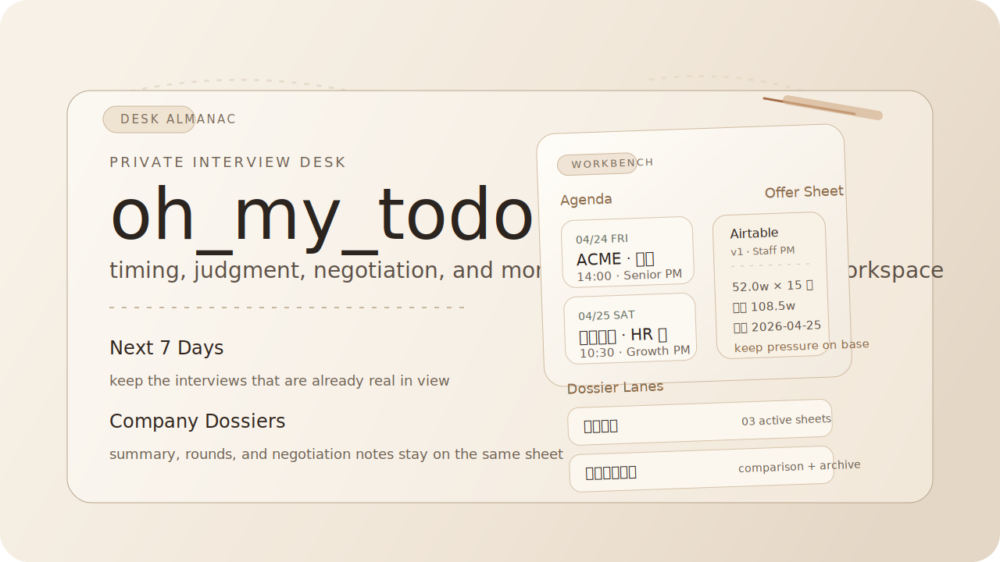
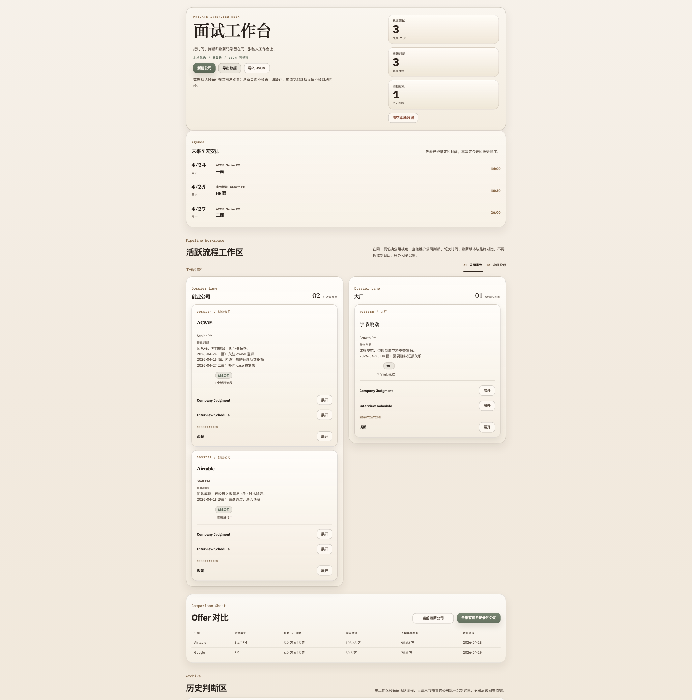

<p align="center">
  
</p>

<h1 align="center">oh_my_todo</h1>

<p align="center">
  <strong>一个把日程、判断、谈薪和对比放在同一张桌面上的私人面试工作台。</strong>
</p>

<p align="center">
  <a href="./README.md">English</a>
</p>

<p align="center">
  
  
  
</p>

<p align="center">
  把未来七天安排、活跃公司 dossier、谈薪快照和 Offer 对比留在同一张安静的本地优先工作台上。
</p>

<p align="center">
  
</p>

## 为什么需要这张桌面

面试推进很少只是把任务一项项打勾。真正重要的，通常是这家公司值不值得继续投入下一轮沟通、下一条判断，或者下一次谈薪。

`oh_my_todo` 把时间安排、公司判断、薪资记录和最终对比放回同一个地方，让下一步决定始终留在眼前。

## 这张桌面上有什么

- 一个只看未来 7 天已定安排的 Agenda。
- 一组按公司展开的 dossier，把总结、轮次记录和谈薪上下文放在同一页。
- 一个用来比较当前谈薪公司或每家公司最新保存包裹 / 快照的 Offer 对比表。
- 一个给已全部归档公司的 Archive 区域。
- 一套用于备份或迁移浏览器数据的 JSON 导出 / 导入。

## 快速开始

### 环境要求

- Node.js `^20.19.0 || >=22.12.0`
- npm

### 安装并运行

```bash
git clone https://github.com/SevenTianyu/oh_my_todo.git
cd oh_my_todo
npm install
npm run dev
```

然后打开 [http://localhost:5173](http://localhost:5173)。

## 如何使用

1. 先创建一家公司和它的第一个流程。
2. 在同一张 dossier 上维护公司总结、面试轮次和谈薪快照。
3. 在公司类型视角和阶段视角之间切换看板。
4. 需要权衡当前谈薪公司或各公司最新保存包裹时，查看 Offer 对比表。
5. 需要备份时导出 JSON，之后再导入同样结构即可恢复这张桌面。

## 隐私和存储

- 数据保存在当前浏览器的 `localStorage` 中。
- 刷新页面不会丢失当前工作台。
- 清理浏览器数据会移除本地副本。
- 换浏览器或换设备不会自动同步。
- 迁移依赖 JSON 导出和导入。

## 开发命令

```bash
npm run dev
npm run test
npm run build
```

如果要跑 Playwright 端到端测试：

```bash
npx playwright install
npm run e2e
```

## 技术栈

- React 19
- TypeScript
- Vite
- Vitest
- Playwright
